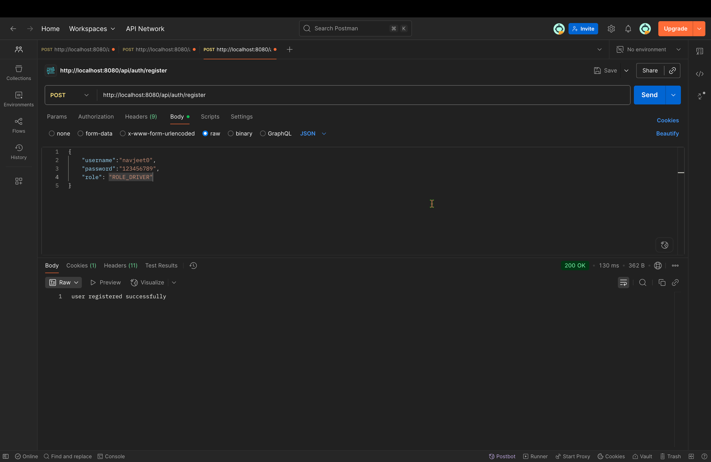
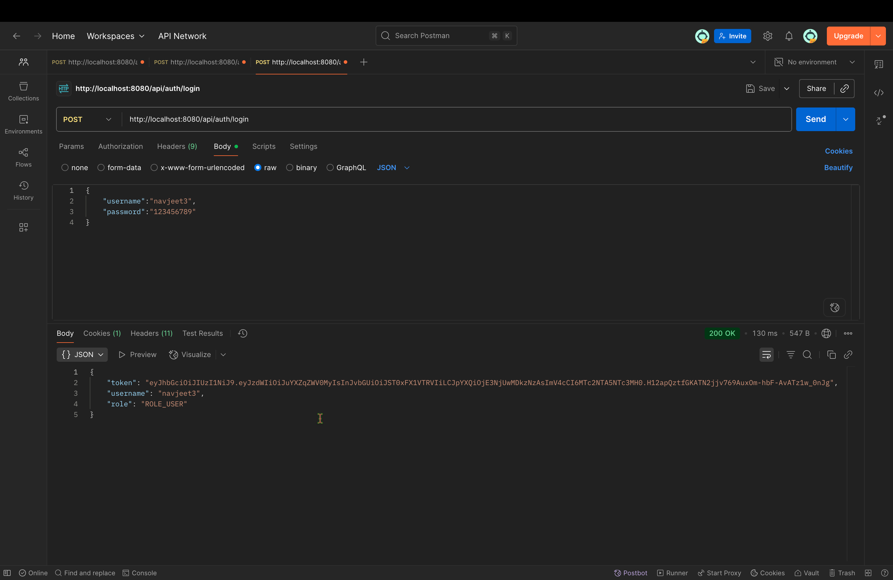
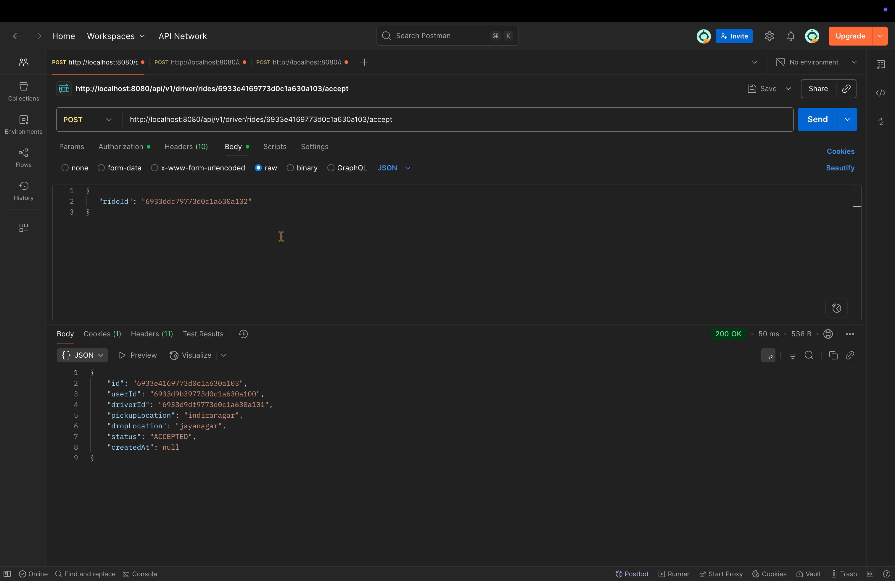
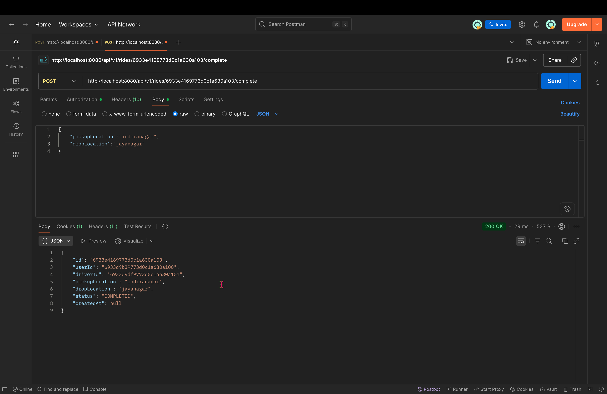

# Uber Clone - Spring Boot Application

This is a simple backend application for a ride-sharing service, similar to Uber, built with Spring Boot.

## Technologies Used

- **Java 21**
- **Spring Boot**
- **Spring Web**: For creating REST APIs.
- **Spring Security**: For authentication and authorization.
- **JWT (JSON Web Tokens)**: For securing the API.
- **MongoDB**: As the database for storing user and ride information.
- **Maven**: For project build and dependency management.

## Features

- User registration and login with JWT authentication.
- Users can request rides.
- Drivers can view and accept pending ride requests.
- Users and drivers can complete rides.
- Users can view their ride history.

## API Endpoints

### Authentication (`/api/auth`)
- `POST /register`: Register a new user.
- `POST /login`: Authenticate a user and get a JWT token.

### Rides (`/api/v1/rides`)
- `POST /`: Request a new ride (requires `ROLE_USER`).
- `POST /{rideId}/complete`: Mark a ride as complete (requires authentication).

### User Rides (`/api/v1/user/rides`)
- `GET /`: Get the ride history for the logged-in user (requires `ROLE_USER`).

### Driver Rides (`/api/v1/driver/rides`)
- `GET /requests`: Get a list of pending ride requests (requires `ROLE_DRIVER`).
- `POST /{rideId}/accept`: Accept a ride request (requires `ROLE_DRIVER`).

## Screenshots

### Register a New User


### Login


### Accept a Ride


### Complete a Ride


## How to Run

### Prerequisites

- Java 21 or later.
- Maven.
- A running instance of MongoDB.

### Configuration

1.  Clone the repository.
2.  Update the `src/main/resources/application.yaml` file with your MongoDB connection details.

### Build and Run

1.  Build the project using Maven:
    ```sh
    mvn clean install
    ```
2.  Run the application:
    ```sh
    mvn spring-boot:run
    ```

The application will start on the configured port (default is 8080).
